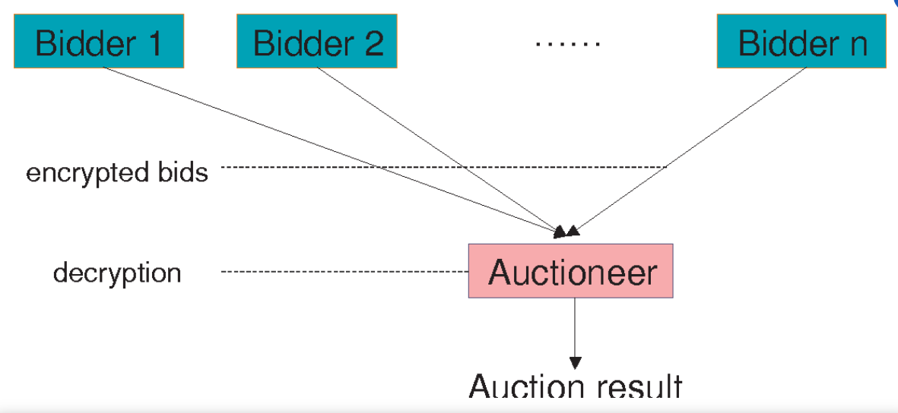

# Getting Started

## Set Up a New Account

ActiList currently supports the desktop version. To access ActiList Auctions, users must have a wallet address on the Secret Network. Wallet address is needed to login to the application and access your private data. If you do not have a wallet address, create it by following to the instructions in *<a href="https://www.youtube.com/watch?v=HgFWNJdD7-U&t=10s" target="_blank">this</a>* video.

## Explore Upcoming NFT Sales

Check *<a href="https://test.actilist.io/marketplace/upcoming" target="_blank">Home Page</a>* for the upcoming featured auctions. The most trending sales will be announced here well in advance so that you have time to plan those events. 

## Sealed Bid Auction

There are different types of auctions. One of those is called sealed bid auction. 

What is a sealed bid auction? 

A sealed bid auction is a blind auction in which all bidders simultaneously submit sealed bids to the auctioneer so that bidder doesn’t know how much the other bidder has bid for. Sealed bid refers to a written bid placed in a sealed envelope.

In a traditional auction process, different people will bid out in order to buy the product and the highest bidder will win the auction.  

However, even in a blind auction, the highest bid still wins, as we don’t know what other bidders are offering. This auction process tends to discourage people from going very low with their offer, as they actually want to win the product or the auction.

In some cases, sealed bid auctions can actually drive up the amount that people offer to spend on products. Depending on the particular NFT products or type of customers that you are looking for, you may decide that a sealed bid auction is the way for you to sell your NFTs.

<!--  -->

