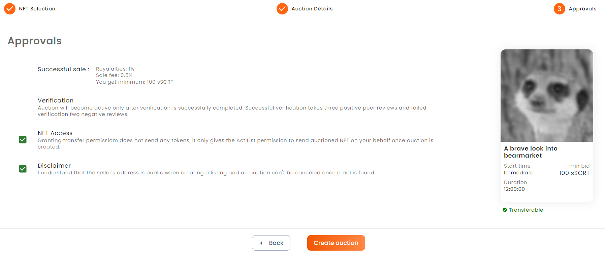

# Sell NFT
You can promote and sell your NFT collections on ActiList via auction sales. ActiList provides a variety of tools to help you successfully market your NFT assets. 

## Steps:
### 1. Mint NFT Collection on Secret Network
You first need to mint your NFT collection on Secret Network blockchain to proceed with auction sales on Actilist. NFT minting feature is our priority and it will be added soon to ActiList. Until then you can also mint via *<a href="https://stashh.io/minter" target="_blank">stashh.io</a>* 
### 2. Create Auction Sale
#### **STEP 1**: Import NFT Colection and Select Auctioned NFT
You start by providing NFT collection address (with "secret" prefix) and loading all NFT items for given collection that are owned by your account. Wait a moment until your owned NFTs are loaded from Secret Network blockchain. Then you can proceed by selecting single NFT that you are going to put for sale. On the right you see a preview indicating the completion of the auction creation process.

 

#### **STEP 2**: Describe Auction
Next you describe "How" and "When" of the auction. Provide currency token that should be used for bids. All supported currency tokens have transactional privacy making bids 100% confidential. Next to that provide the minimum bid that will be accepted. Indicate start time and duration. Don't forget a catchy description to make your sale stand out.

#### **STEP 3**: Grant Transfer Rights to ActiList and Create Auction
Finally, you can review auction details. Check price structure of the auction sale. Depending on NFT collection royalty fee may be included to reward original creator of the sold NFT. You will need to grant ActiList application with transfer rights since ActiList will be moderating sale on your behalf. For the duration of auction sale NFT will be locked in application's smart contract. Check that you agree with disclaimer and so you are ready to create new auction. Press **Create** button and sign auction sale creation transaction with your wallet. If successful you will be prompted with success message. At this point auction is submitted, but it will still need peer review before it is published and active for sale.  

### 3. Get Auction Verified
### 4. Follow Auction Progress
### 5. (Optionally) Amend/Extend Auction
### 6. Finalize Auction
Because in a sealed bid auction, no one knows if they are the highest bidder until after the auction ends, the bidder has no further actions after placing his bid. For this reason, the auction owner can finalize the auction at any time. I

Before that time, only the auction creator can finalize the auction. At that time or later, anyone may finalize the auction. Bid will still be accepted after the ends_at time if no one has closed the auction yet.

