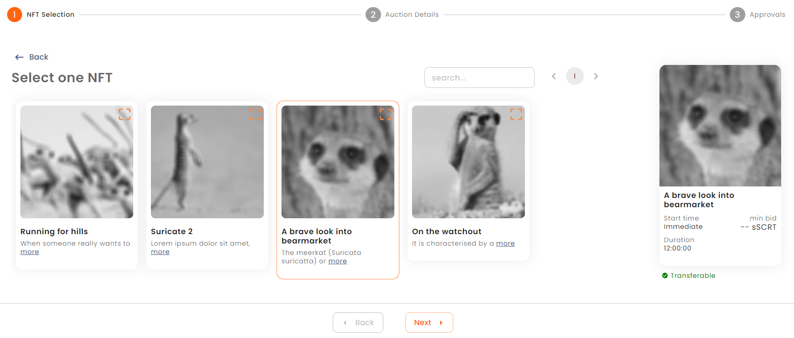
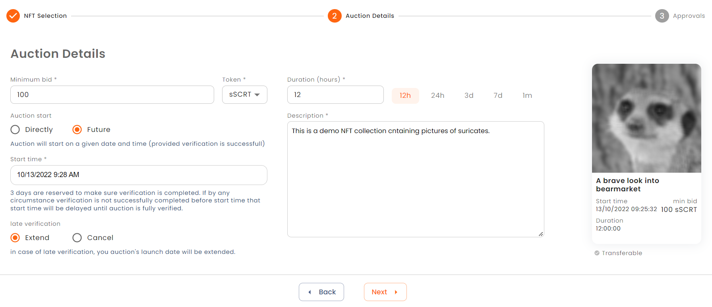
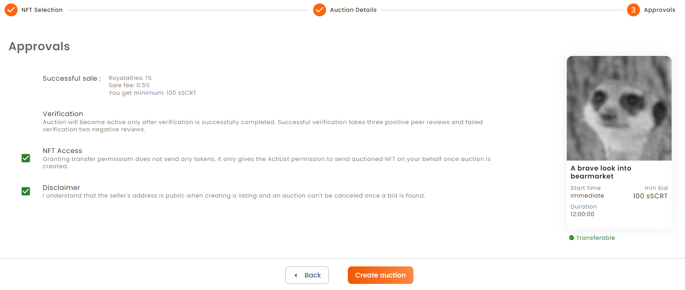

# Sell NFTs
You can promote and sell your NFT collections on ActiList via auction sales. ActiList provides a variety of tools to help you successfully market your NFT assets. 

## Steps:
### 1. Mint NFT Collection on Secret Network
You first need to mint your NFT collections on *<a href="https://scrt.network/" target="_blank">Secret Network</a>* blockchain to proceed with auction sales on Actilist. The NFT minting feature is our priority and it will be added soon to ActiList. Until then you can mint your NFTs via *<a href="https://stashh.io/minter" target="_blank">stashh.io</a>* 
### 2. Create Auction Sale
#### **STEP 1**: Import NFT Colections and Select Auctioned NFT
You start by providing NFT collections address (with "secret" prefix) and load all NFT items for given collection that are owned by your account. Wait a moment until your NFTs are loaded from Secret Network blockchain. Then you can proceed by selecting single NFT that you are going to put for sale. On the right, you see a preview indicating the completion of the auction creation process.

 

#### **STEP 2**: Describe Auction
Next you describe "How" and "When" of the auction. Provide a currency token that should be used for the bids. All supported currency tokens have transactional privacy making bids 100% confidential. Next to that, provide the minimum bid that will be accepted. Indicate start time and duration. Don't forget to add a catchy description to make your NFT stand out.

#### **STEP 3**: Grant Transfer Rights to ActiList and Create Auction
Finally, you can review auction details, check price structure of the auction sale. Depending on NFT collections royalty fee may be included to reward original creators of the sold NFT. You will need to grant ActiList application transfer rights for your NFT since ActiList will be moderating sales on your behalf. 
For the duration of auction sale, the NFTs will be locked in application's smart contract. Check that you agree with disclaimer and be ready to create a new auction. Press **Create** to sign transaction with your wallet. If successful you will see a popup with success message. At this point auction is submitted, but peer review is needed before NFT sale is published and once it is done, it can be seen by everyone.  

### 3. Get Auction Verified
Since ActiList is completely open for everyone to sell their NFTs, it is important to have a meaningful review of the auction contents before they get online. For this purpose a peer review mechanism has been introduced. 
Before auction sale is accepted and becomes public it should be approved by three independent verifiers by performing several validation checks. Verifiers are normally active platform users and they agree to receive notifications when there is a new auction sale to verify. 
Make sure to plan a few days ahead of your sale date, so there is enough time given for the verification of your NFTs. To be on the safer side, set aside three days for verification, before you plan your NFT sale time and date. 

### 4. Follow Auction Progress
You can see all your auctions in your personal dashboard under *<a href="https://test.actilist.io/dashboard/my-auctions" target="_blank">Auctions</a>* section. You need to be logged in to see your personal dashboard. You can also follow the verification process of your upcoming sales in a form of progress bar with the number of approvals and disapprovals. When auction sale is verified, it becomes active. If applicable, you can take additional actions for your sales from here. _If we can add screenshots of the process, it would help users understand more clearly._

### 5. (Optionally) Change Auction Parameters
A few auction parameters can be changed without additional verification, as long as there are no active bids. One of them is a minimum bid. It can be changed to adjust the auction to current demand. It is also possible to adjust actions end time. This way you can extend the auction if no bids were received yet.

### 6. Finalize Auction Sale
Auction creator can finalize the auction at any moment. This step marks the completion of auction sale. The highest bid wins and the NFT is directly transferred to the winner. Other bids are also directly returned to auction participants. The seller recieves the winning bid excluding royalties (usually a small percentage that is paid to NFT creators from each sale).

