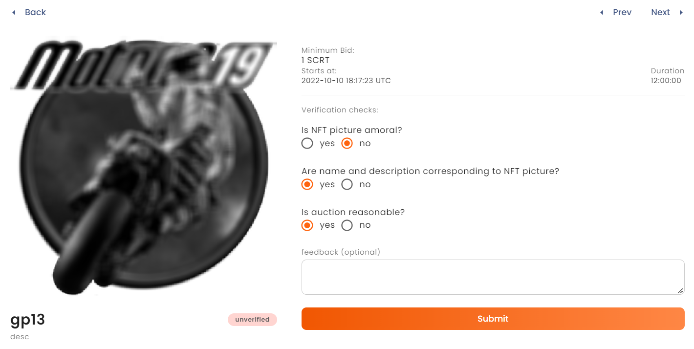

# Verify Auctions
Since ActiList is completely open for everyone to sell their NFTs, it is important to have a meaningful review of the auction contents before they go online. For this purpose peer review mechanism has been introduced. Before an auction sale is accepted and becomes public, it should be approved by three independent verifiers based on a few checkpoints. 
Verifications are paid activity and verifiers are financially rewarded for helping keep ActiList clean. Everyone can become a verifier on ActiList and there are also additional bonuses to incentivise our core users. You can find steps that are necessary to become an ActiList verifier below.  
## Steps:
### 1. Set Up Notifications
First you need to set up Telegram notifications to be notified about newly created auctions. You can do so in your personal dashboard under *<a href="https://test.actilist.io/dashboard/my-auctions" target="_blank">Notifications</a>* section. Type in your telegram handle and press **Connect** button to connect with ActiList notifications bot. Done!
### 2. Browse Unverified Auctions
You can find all unverified auctions in your personal dashboard under *<a href="https://test.actilist.io/dashboard/verifications" target="_blank">Verifications</a>* section. From here you can conveniently verify correctness of auction data and submit your review. 
### 3. Verify Auctions
At the moment when auction sale is finalized all involved verifiers are paid their rewards.

