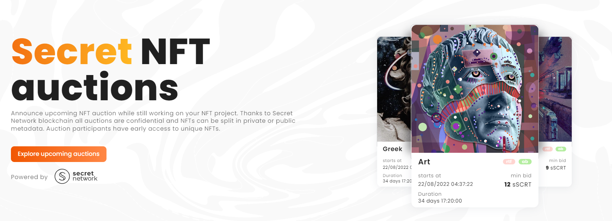

# ActiList - an Interactive NFT Marketplace with Secret Auctions and Access Control

Welcome to ActiList, a first interactive NFT marketplace with confidential bidding and customizable NFT access control. 

ActiList makes buying NFTs more interactive and engaging, thanks to different types of auctions and NFT owners for the first time have full access control over private sensitive attributes of their NFT assets. 

**First of a kind NFT Marketplace**

ActiList is the first of its kind trustless NFT marketplace providing unmatched level of data privacy to auction participants and perspective owners. Sensitive NFT metadata such as ownership details and transaction history are hidden by default and only NFT owners can make this information public if there is a wish to do so. The same holds true for any data stored inside NFT. 

Full access control over private NFT attributes starts a new era of NFT development making NFTs more like containers of value, which can represent any sensitive data making NFT utility almost limitless.

**Powered by Secret Network blockchain**

ActiList runs on the Secret Network blockchain which uses the state of the art technology infrastructure for running computations over encrypted data. Your private data inside NFT is encrypted on hardware level with SGX technology and no one except you has access to it. You get to choose what you share, with whom and how. Over time, ActiList is going to provide portability for NFT assets from other popular blockhains, providing customizable privacy as additional feature to existing NFTs. We are privacy pioneers and want our users to be the true owners of their data.

**What is Secret Network and how it works**

Secret Network blockchain is a privacy-oriented blockchain that brings data confidentiality to decentralized applications. Its smart contracts are called Secret Contracts and allow dapps to use private data on Secret, similar to how smart contracts operate on other blockchains.

Unlike other blockchains, Secret Network keeps all application data private and only the user decides what information can be shared with whom, when and how. Secret Network supports a special standard - snip721 (also called Secret NFT). 

NFT auctions are making ActiList a highly interactive and engaging place to buy and sell NFTs. Elements of the game and uncertainty of the outcome are adding more energy to the process. 

Active users will be rewarded and there is always a chance of buying a valuable NFT for just a fraction of its market value. 

**Reliable platform for NFT creators**

For NFT owners, ActiList is going to be a reliable platform to promote their NFTs with the upcoming auctions. It is a time consuming process to create art NFTs or any other valuable NFTs. That time can still be used by artists and creators to raise awareness of the product they are building. 

To support this, there is an option to create an auction with a future start date. Auction would not start without a submitted NFT, but anyone interested could set a reminder to be notified about proceedings of the auction.

Since winning the hackathon and receiving the development grant from Secret Network in early 2022, our team has been busy implementing the first type of NFT auction which will be Sealed Bid Auction. 

As now this is done and after successful go-live around the end of the year, we will be gradually adding new auction types and improving overall user experience. 

For the next major changes, we will be reaching out to the community to align our development work with your expectations.

